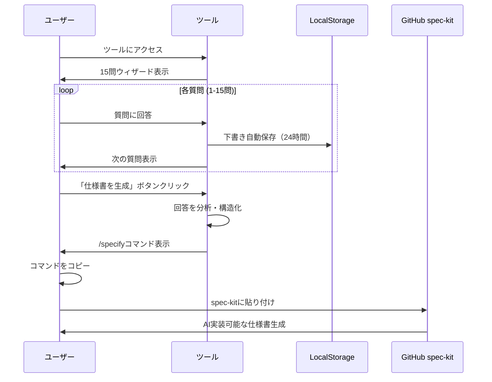

# 業務改善システム自動具体化ツール


## 📋 概要

**業務改善システム自動具体化ツール**は、非エンジニア向けに特化したWebアプリケーションです。
15の質問に答えるだけで、GitHub spec-kitで使用できる業務改善システムの仕様コマンドを自動生成します。

### 🎯 特徴

- ✅ **15問ウィザード**: 体系化された質問で網羅的な要件収集
- ✅ **日本語完全対応**: 非エンジニアにも分かりやすいインターフェース
- ✅ **ワンクリック生成**: /specifyコマンド形式で即座に出力
- ✅ **WCAG 2.1 AA準拠**: アクセシビリティ完全対応
- ✅ **ブラウザ完結**: インストール不要、すぐに使える

## 🚀 クイックスタート（一般ユーザー向け）

### Windows用 一発導入

1. **install.bat** をダウンロード
2. ダブルクリックで実行
3. 自動でNode.jsインストール → プロジェクトセットアップ → ブラウザ起動

### 手動セットアップ

#### 必要環境
- Node.js 18.x以上
- モダンブラウザ（Chrome, Firefox, Safari, Edge）

#### インストール手順

```bash
# 1. プロジェクトをダウンロード
git clone https://github.com/rikumiura32543/spec_form.git
cd spec_form

# 2. 依存関係をインストール
npm install

# 3. 開発サーバー起動
npm run dev

# 4. ブラウザでアクセス
# http://localhost:5173/ が自動で開きます
```

## 📊 システム利用フロー

```mermaid
graph TD
    A[ツール起動] --> B[15問ウィザード開始]
    B --> C[Layer 1: 目的・目標<br/>5問回答]
    C --> D[Layer 2: プロセス・関係者<br/>5問回答]
    D --> E[Layer 3: 技術・統合<br/>5問回答]
    E --> F[/specify コマンド生成]
    F --> G[GitHub spec-kitに貼り付け]
    G --> H[AI実装フェーズ]
    
    style A fill:#4CAF50
    style F fill:#2196F3
    style H fill:#FF9800
```

## 🔄 詳細シーケンス図



## 📁 プロジェクト構成

```
spec_form/
├── src/
│   ├── components/
│   │   ├── ui/              # UIコンポーネント
│   │   └── wizard/          # ウィザード関連
│   ├── hooks/               # カスタムフック
│   ├── types/               # TypeScript型定義
│   └── utils/               # ユーティリティ関数
├── public/                  # 静的ファイル
├── install.bat             # Windows一発導入用
├── package.json
├── README.md
└── CLAUDE.md               # 開発者向けドキュメント
```

## 🎮 使い方

### 1. 基本的な使用方法

1. **ツール起動**: ブラウザでアクセス
2. **質問回答**: 15問の質問に順番に回答
   - **Layer 1 (1-5問)**: 目的・目標・期限・予算・優先度
   - **Layer 2 (6-10問)**: プロセス・関係者・部署・頻度  
   - **Layer 3 (11-15問)**: 技術・統合・セキュリティ
3. **自動保存**: 回答は自動で保存（24時間保持）
4. **仕様生成**: 完了後、/specifyコマンドが生成される
5. **コピー**: ワンクリックでクリップボードにコピー

### 2. 出力形式

生成される/specifyコマンド例：
```
/specify "業務効率化を目的とした業務改善システムを構築する。処理時間50%短縮を実現するため、手動プロセスにおける作業負荷を解決し、複数部署間での定期的な業務を効率化。既存ツールからシステム連携への移行を含む包括的なソリューション。"
```

## 🛠️ 開発者向け

### 利用可能なスクリプト

```bash
# 開発サーバー起動
npm run dev

# 本番ビルド
npm run build

# プレビュー
npm run preview
```

### 技術スタック

- **React 18**: 最新のReactエコシステム
- **TypeScript 5.0+**: 型安全性
- **Vite**: 高速ビルドツール  
- **TailwindCSS**: ユーティリティファーストCSS

## 🔒 プライバシー・セキュリティ

### データ保護

- ✅ **完全ローカル処理**: 回答データは外部送信なし
- ✅ **24時間自動削除**: ブラウザ保存データの自動消去
- ✅ **PII検出**: 個人情報の自動検出・警告
- ✅ **暗号化保存**: ローカルデータの適切な保護

## ♿ アクセシビリティ

### WCAG 2.1 AA準拠

- **キーボードナビゲーション**: 全機能がキーボードのみで操作可能
- **スクリーンリーダー対応**: NVDA、JAWS、VoiceOver対応
- **44px最小タッチサイズ**: モバイルでの操作性確保
- **高コントラスト対応**: 視認性の向上

## 📈 対応ブラウザ

- Chrome 90+
- Firefox 88+
- Safari 14+
- Edge 90+

## 🤝 コントリビューション

1. リポジトリをフォーク
2. フィーチャーブランチを作成
3. 変更をコミット
4. プルリクエストを作成

## 📝 ライセンス

MIT License - 詳細は[LICENSE](LICENSE)ファイルをご覧ください。

## 🆘 サポート

### トラブルシューティング

**Q: 開発サーバーが起動しない**
```bash
# ポート変更
npm run dev -- --port 3000

# キャッシュクリア
npm run dev -- --force
```

**Q: 下書きデータが消えた**
- 24時間経過で自動削除される仕様です
- ブラウザのLocalStorageをクリアした場合も消えます

### サポート窓口

- GitHub Issues: [問題報告・機能要求](https://github.com/rikumiura32543/spec_form/issues)
- 開発者向け: CLAUDE.mdをご参照ください

---

**最終更新**: 2025年9月6日  
**バージョン**: v1.0.0  
**ステータス**: ✅ Production Ready